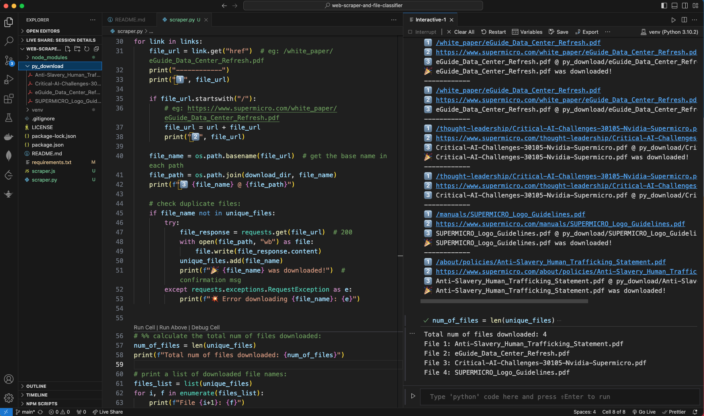
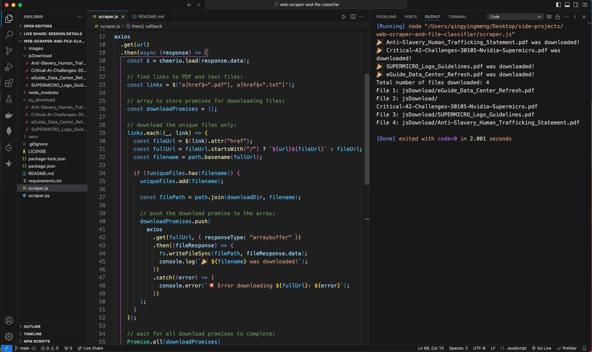

# Web Scraper & File Classifier

## Tasks:

Write a program to download ALL PDF and text files from a specified website in both Python and Javascript.

- What is the total number of files downloaded? Print out a list of the downloaded file names.
- Bonus: categorize the documents into logical groupings (e.g., success stories, case studies, brochures, datasheets, guides, briefs, white papers, misc, etc.) with the per-category file counts.

## Setup:

1. create & activate a virtual environment:
   ```
   python -m venv venv
   source venv/bin/activate
   ```
2. Upgrade the pip package manager to the latest version within the current Python environment: `python -m pip install --upgrade pip`
3. Create the `requirements.txt` file after installing dependencies and libraries: `pip freeze > requirements.txt`

## Result screenshots:




## Resources:

1. [Python Package Index](https://pypi.org/)
2. [Hugging Face Models](https://huggingface.co/models)
